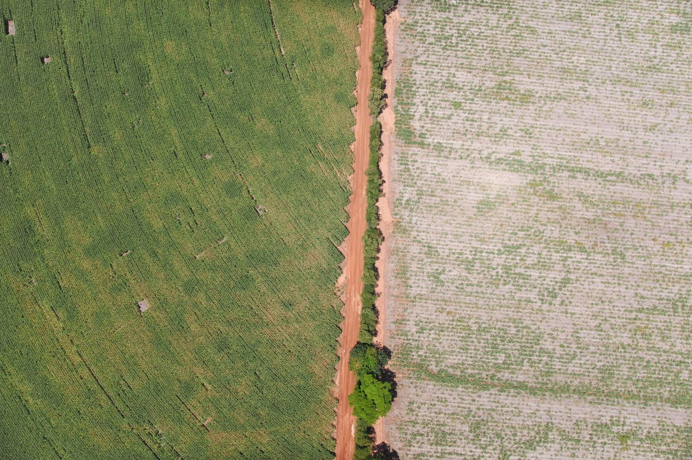
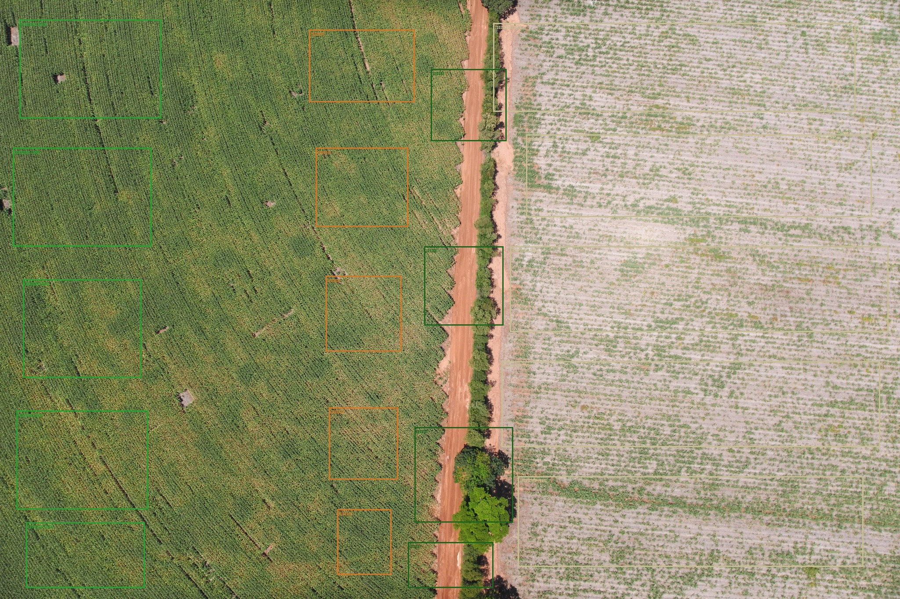
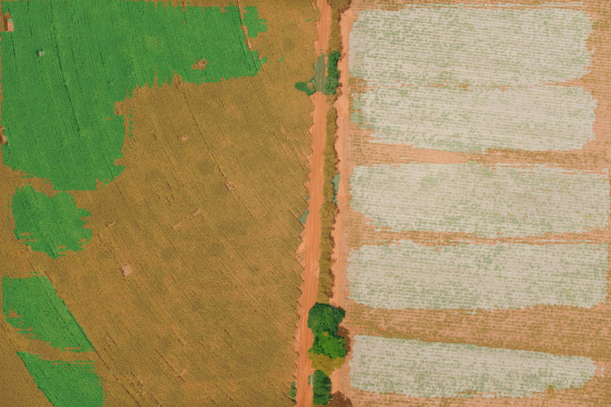
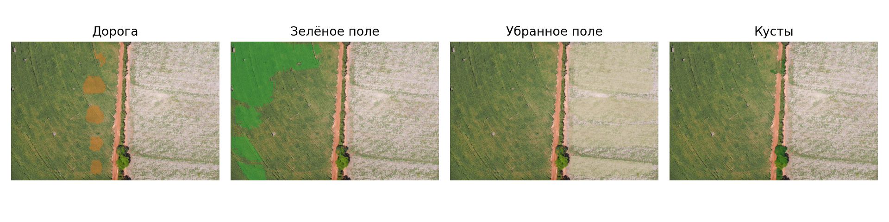
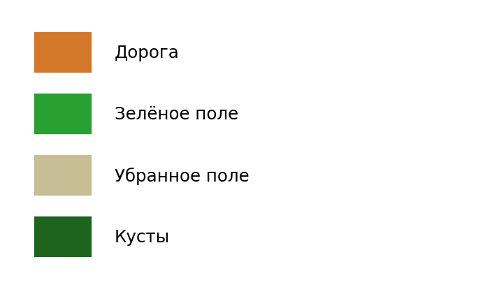
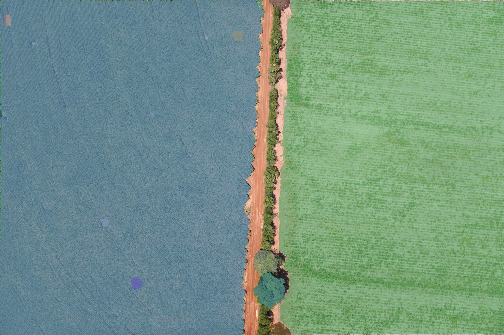
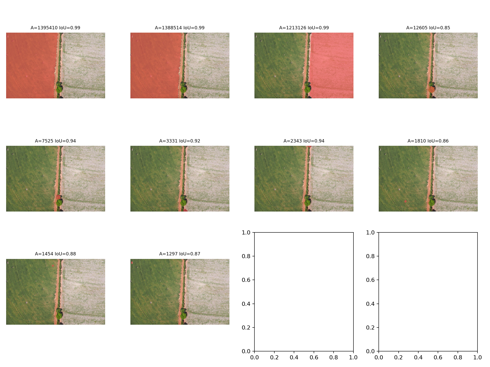
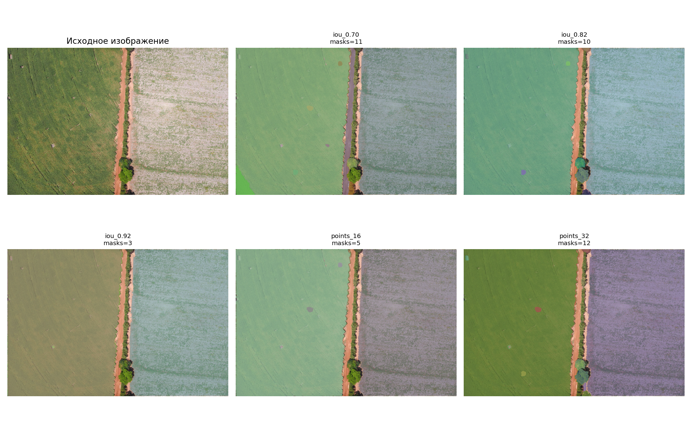

#+LANGUAGE: ru
#+LATEX_HEADER: \usepackage{fontspec}
#+LATEX_HEADER: \usepackage{polyglossia}
#+LATEX_HEADER: \setdefaultlanguage{russian}
#+LATEX_HEADER: \setmainfont{DejaVu Serif}
#+LATEX_CLASS: extarticle
#+LATEX_CLASS_OPTIONS: [a4paper,14pt]
#+OPTIONS: toc:nil

#+begin_center
МФТИ\
\vspace{6cm}
\textbf{Лабораторная работа 2}\
\vspace{0.6cm}
\textbf{Сегментация аэрофотоснимка (SAM 2.1)}\
\vspace{4cm}
\textbf{Судаков Алексей}\
\vspace{8cm}
Долгопрудный\
2026
\pagebreak
#+end_center

* Исходные данные
Использован аэрофотоснимок =грунт дорога пое зеленое и убранное.tiff= (5472×3648).
Выделены классы поверхности: дорога, зелёное поле, убранное поле, кусты.
Разметка выполнена в формате labelme (прямоугольники в =annotations/source.json=).

* Подготовка датасета
Из размеченных прямоугольников вырезаны патчи 128×128 пикселей (папка =dataset/=).
[[file:output/dataset_summary.json]]

* SAM 2.1 — сегментация по подсказкам (box prompts)
Модель: =sam2.1_hiera_tiny.pt= (SAM 2.1 Hiera-Tiny).
Для каждого прямоугольника labelme подаётся box-prompt; маски объединяются в карту классов.

* SAM 2.1 — автоматическая генерация масок
Automatic Mask Generator строит маски по сетке точек на всём изображении.

* Влияние параметров
Сравнение при разных =pred_iou_thresh=, =stability_score_thresh= и =points_per_side=.

* Выводы
SAM 2.1 по box-prompts из labelme даёт семантическую карту поверхностей с цветной полупрозрачной наложенной сегментацией.
При увеличении порогов качества (pred_iou, stability) число масок уменьшается, остаются более уверенные регионы.
Увеличение =points_per_side= повышает детализацию, но увеличивает время работы.
